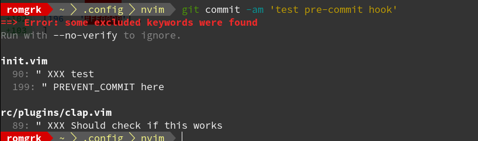

# git-config

This is my git config. You should use it. You have more cool tricks? Open a PR :)

### Install

```bash
git clone https://github.com/romgrk/git-config
cd git-config

# for the gitconfig
git config --global include.path $(pwd)/config

# for the ignore file
git config --global core.excludesfile $(pwd)/ignore

# for the pre-commit hook
git config --global core.hooksPath $(pwd)/hooks

# for the pager
# see https://github.com/so-fancy/diff-so-fancy
```

## aliases

All aliases are included by including the config.

### `git fpr`: fetch-pull-request

Run `git fpr 28` and it retrieves the PR #28 as the branch `pr-28`.

```
[alias]
    fpr = "!sh -c 'nr=\"$1\" ; shift ; git fetch upstream refs/pull/$nr/head:pr-$nr \"$@\"' -"
```

Credits: someone other than me created this but I don't remember who :/ I think I
found it on an issue in the neovim repo.

## pre-commit hook

This hook prevents the commit from completing if some restricted keywords
are present in the commit text. The default keywords are `XXX` and `PREVENT_COMMIT`.
You can also define your own keywords by setting the env var `GIT_PREVENT_COMMIT` to
a comma-separated list of restricted keywords.

This is useful if you are in the flow and touching many different files. If you
add some development code that shouldn't end up in your repository, simply add
one of the keywords and you'll be sure to be notified if you try to commit it by
error.


